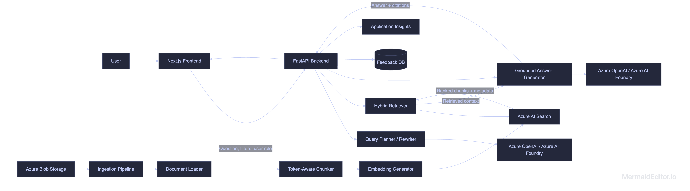
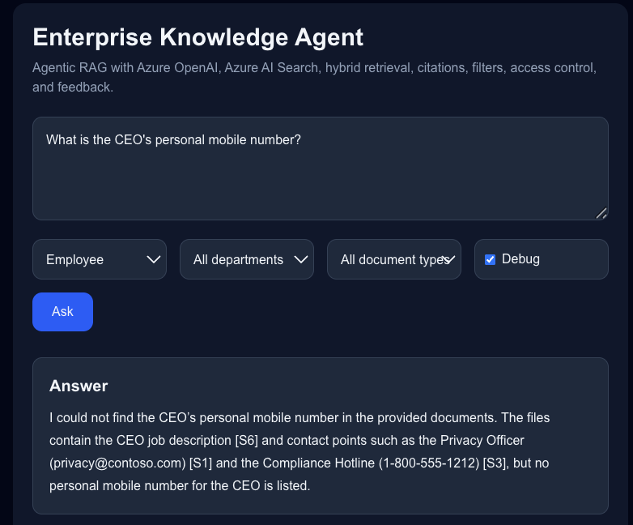
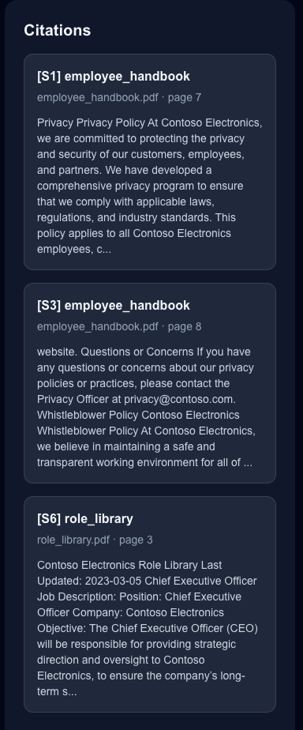
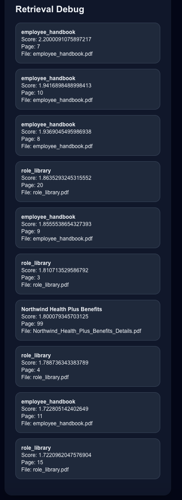

# Enterprise Knowledge Agent with Agentic RAG

An enterprise knowledge assistant that answers questions from internal company documents using **Azure OpenAI / Azure AI Foundry, Azure AI Search, hybrid retrieval, vector search, FastAPI, Next.js, Docker, and GitHub Actions**.

The system supports document ingestion, query rewriting, multi-step retrieval, role-based access control, source-grounded answers, citations, feedback collection, and evaluation.

---


## Features

### Document Processing

* Upload and ingest enterprise-style documents
* Supports PDF, DOCX, TXT, Markdown, and CSV files
* Extracts text from documents
* Splits documents into token-aware chunks
* Adds metadata such as department, document type, sensitivity, source file, page number, and allowed roles
* Generates embeddings for each chunk
* Stores indexed chunks in Azure AI Search

### Retrieval

* Hybrid search using keyword search and vector search
* Semantic ranking support
* Metadata filtering by department, document type, and sensitivity
* Role-based retrieval using document-level access rules
* Multi-query retrieval for complex questions
* Retrieval debug mode to inspect matched documents, scores, and subqueries

### Agentic RAG

* Rewrites user questions into better search queries
* Breaks complex questions into focused subqueries
* Retrieves information from multiple relevant documents
* Generates answers only from retrieved source context
* Returns citations with every grounded answer

### Security and Access Control

* Role-based document access control
* Simulated user roles through request headers
* Document-level `allowed_roles` metadata
* Retrieval-time filtering to prevent unauthorized documents from being used as context

### Evaluation and Feedback

* Feedback collection endpoint
* User rating storage
* Evaluation questions in JSONL format
* Source recall measurement
* Citation count tracking
* Latency measurement
* Hallucination test cases

### Engineering

* FastAPI backend
* Next.js frontend
* Azure OpenAI / Azure AI Foundry integration
* Azure AI Search integration
* Azure Blob Storage support
* Application Insights support
* Dockerized services
* GitHub Actions CI
* Ruff linting and formatting

---

## Tech Stack

| Layer         | Technology                               |
| ------------- | ---------------------------------------- |
| Frontend      | Next.js, React, TypeScript, Tailwind CSS |
| Backend       | FastAPI, Python                          |
| LLM           | Azure OpenAI / Azure AI Foundry          |
| Embeddings    | Azure OpenAI Embeddings                  |
| Search        | Azure AI Search                          |
| Storage       | Azure Blob Storage                       |
| Feedback DB   | SQLite                                   |
| Evaluation    | Python, Pandas, JSONL                    |
| Observability | Application Insights                     |
| DevOps        | Docker, GitHub Actions                   |
| Code Quality  | Ruff                                     |

---

## System Architecture




---

## How the System Works

### 1. Document Ingestion

Documents are placed inside the `data/raw/` directory. Each document is loaded, parsed, chunked, embedded, and indexed into Azure AI Search.

Pipeline:

```text
Document → Text Extraction → Chunking → Metadata Enrichment → Embeddings → Azure AI Search Index
```

Each indexed chunk contains:

* `content`
* `content_vector`
* `title`
* `source_file`
* `source_url`
* `page`
* `chunk_index`
* `department`
* `doc_type`
* `sensitivity`
* `allowed_roles`

---

### 2. Query Planning

When a user asks a question, the backend first sends it to the query planner.

The planner produces:

* A rewritten search query
* One or more focused subqueries
* Optional metadata filters

Example user question:

```text
Compare the Standard Benefits Plan and the Health Plus Benefits Plan.
```

Example generated subqueries:

```text
Standard Benefits Plan coverage and eligibility
Health Plus Benefits Plan coverage and eligibility
Differences between Standard Benefits Plan and Health Plus Benefits Plan
```

---

### 3. Hybrid Retrieval

The retriever performs hybrid search against Azure AI Search.

It combines:

* Keyword search
* Vector similarity search
* Semantic ranking
* Metadata filters
* Role-based access filters

The system retrieves the most relevant chunks and passes them to the answer generation layer.

---

### 4. Source-Grounded Answer Generation

The answer generator receives the user question and retrieved source chunks.

It follows these rules:

* Use only the retrieved context
* Cite sources using citation IDs such as `[S1]`, `[S2]`
* Do not invent unsupported details
* Return a clear fallback response when the answer is not found

Example answer:

```text
The Health Plus Benefits Plan provides broader coverage than the Standard Benefits Plan [S1]. The Standard Benefits Plan focuses on baseline employee coverage [S2].
```

---

### 5. Citations

Each answer includes citations with:

* Citation ID
* Document title
* Source file
* Page number
* Content preview

Example citation:

```json
{
  "id": "S1",
  "title": "Northwind Health Plus Benefits",
  "source_file": "Northwind_Health_Plus_Benefits_Details.pdf",
  "source_url": "Northwind_Health_Plus_Benefits_Details.pdf#page=3",
  "page": 3,
  "content_preview": "The Health Plus Benefits Plan provides..."
}
```

---

## Repository Structure

```text
enterprise-knowledge-agent-rag/
│
├── backend/
│   ├── app/
│   │   ├── main.py
│   │   ├── schemas.py
│   │   │
│   │   ├── core/
│   │   │   └── config.py
│   │   │
│   │   ├── services/
│   │   │   ├── answerer.py
│   │   │   ├── chunker.py
│   │   │   ├── document_loader.py
│   │   │   ├── feedback.py
│   │   │   ├── ingest.py
│   │   │   ├── llm.py
│   │   │   ├── planner.py
│   │   │   ├── retriever.py
│   │   │   ├── search_index.py
│   │   │   └── telemetry.py
│   │   │
│   │   └── db/
│   │       └── feedback.db
│   │
│   ├── requirements.txt
│   ├── Dockerfile
│   └── .env.example
│
├── frontend/
│   ├── app/
│   ├── components/
│   ├── package.json
│   └── Dockerfile
│
├── data/
│   ├── raw/
│   ├── processed/
│   └── metadata.csv
│
├── eval/
│   ├── questions.jsonl
│   ├── run_eval.py
│   └── eval_results.csv
│
├── docs/
│   ├── architecture.md
│   ├── sample_queries.md
│   ├── eval_report.md
│   └── images/
│       └── architecture.png
│
├── .github/
│   └── workflows/
│       ├── backend-ci.yml
│       └── frontend-ci.yml
│
├── docker-compose.yml
└── README.md
```

---

## Environment Variables

Create a `.env` file inside the `backend/` directory.

```env
AZURE_OPENAI_ENDPOINT=https://your-azure-openai-resource.openai.azure.com/
AZURE_OPENAI_API_KEY=your_azure_openai_key
AZURE_OPENAI_API_VERSION=2024-10-21

AZURE_OPENAI_CHAT_DEPLOYMENT=gpt-5-mini
AZURE_OPENAI_EMBEDDING_DEPLOYMENT=text-embedding-3-small
EMBEDDING_DIMENSIONS=1536

AZURE_SEARCH_ENDPOINT=https://your-search-service.search.windows.net
AZURE_SEARCH_KEY=your_azure_search_admin_key
AZURE_SEARCH_INDEX=enterprise-kb-index

AZURE_STORAGE_CONNECTION_STRING=your_storage_connection_string
AZURE_STORAGE_CONTAINER=enterprise-kb

APPLICATIONINSIGHTS_CONNECTION_STRING=
```

Do not commit `.env` to GitHub.

Use `.env.example` for safe configuration sharing.

---

## Local Setup

### 1. Clone the Repository

```bash
git clone https://github.com/your-username/enterprise-knowledge-agent-rag.git
cd enterprise-knowledge-agent-rag
```

---

### 2. Backend Setup

```bash
cd backend
python -m venv .venv
source .venv/bin/activate
pip install -r requirements.txt
```

For Windows:

```powershell
cd backend
python -m venv .venv
.venv\Scripts\activate
pip install -r requirements.txt
```

---

### 3. Configure Backend Environment

```bash
cp .env.example .env
```

Update the `.env` file with your Azure values.

---

### 4. Create Azure AI Search Index

```bash
python -m app.services.search_index
```

---

### 5. Ingest Documents

Place documents inside:

```text
data/raw/
```

Then run:

```bash
python -m app.services.ingest
```

---

### 6. Run Backend

```bash
uvicorn app.main:app --reload --port 8000
```

Backend URL:

```text
http://localhost:8000
```

Swagger API docs:

```text
http://localhost:8000/docs
```

---

### 7. Frontend Setup

Open a new terminal from the project root.

```bash
cd frontend
npm install
npm run dev
```

Frontend URL:

```text
http://localhost:3000
```

---

## Run with Docker

From the project root:

```bash
docker compose up --build
```

Services:

| Service  | URL                          |
| -------- | ---------------------------- |
| Frontend | `http://localhost:3000`      |
| Backend  | `http://localhost:8000`      |
| API Docs | `http://localhost:8000/docs` |

---

## API Endpoints

| Method | Endpoint            | Description          |
| ------ | ------------------- | -------------------- |
| `GET`  | `/health`           | Health check         |
| `POST` | `/chat`             | Ask a question       |
| `POST` | `/feedback`         | Submit feedback      |
| `GET`  | `/feedback/summary` | Get feedback summary |

---

## Example Chat Request

```bash
curl -X POST http://localhost:8000/chat \
  -H "Content-Type: application/json" \
  -H "X-User-Roles: employee" \
  -d '{
    "question": "What benefits are covered under the health plan?",
    "filters": {
      "department": "hr"
    },
    "debug": true
  }'
```

---

## Example Chat Response

```json
{
  "answer": "The health plan includes coverage for medical services and employee benefits based on the available HR documents [S1].",
  "citations": [
    {
      "id": "S1",
      "title": "Northwind Health Plus Benefits",
      "source_file": "Northwind_Health_Plus_Benefits_Details.pdf",
      "source_url": "Northwind_Health_Plus_Benefits_Details.pdf#page=3",
      "page": 3,
      "content_preview": "The Health Plus Benefits Plan provides..."
    }
  ],
  "rewritten_query": "health plan covered employee benefits",
  "subqueries": [
    "health plan covered benefits",
    "employee benefits eligibility"
  ],
  "latency_ms": 4210
}
```

---

## Role-Based Access Control

Each indexed document chunk contains an `allowed_roles` field.

Example metadata:

```csv
filename,title,department,doc_type,sensitivity,allowed_roles
Contoso_Employee_Handbook.pdf,Contoso Employee Handbook,hr,policy,internal,"employee,hr,admin"
Finance_Report.pdf,Quarterly Finance Report,finance,report,confidential,"finance,admin"
Legal_Contract.pdf,Vendor Contract,legal,contract,restricted,"legal,admin"
```

The backend reads the user role from the request header:

```http
X-User-Roles: employee
```

Only documents that match the user role are included in retrieval.

---

## Example Questions

### Basic Retrieval

```text
What benefits are covered under the health plan?
```

### Comparison

```text
Compare the Standard Benefits Plan and the Health Plus Benefits Plan.
```

### Multi-Step Retrieval

```text
Can a new employee enroll immediately, and what medical benefits are available?
```

### Role-Based Access

```text
Show me all HR policies.
```

Test the same query with different roles:

```text
employee
hr
admin
```

### Hallucination Test

```text
What is the CEO's personal mobile number?
```

Expected behavior:

```text
I could not find that information in the available knowledge base.
```

---

## Evaluation

The evaluation pipeline is located in the `eval/` directory.

It checks:

* Source recall
* Citation count
* Expected answer keywords
* Latency
* Unsupported question handling

Run the backend first:

```bash
cd backend
uvicorn app.main:app --reload --port 8000
```

Then run the evaluation script from the project root:

```bash
python eval/run_eval.py
```

Results are saved to:

```text
eval/eval_results.csv
```

Example metrics:

| Metric                       |  Value |
| ---------------------------- | -----: |
| Source Recall                | `0.83` |
| Citation Coverage            | `100%` |
| Average Latency              | `4.2s` |
| Hallucination Test Pass Rate |  `90%` |

Update these values after running your own evaluation.

---

## Code Quality

Run lint checks:

```bash
cd backend
ruff check app
```

Format backend code:

```bash
ruff format app
```

Check formatting:

```bash
ruff format --check app
```

---

## CI/CD

GitHub Actions workflows are included for backend and frontend checks.

Workflow files:

```text
.github/workflows/backend-ci.yml
.github/workflows/frontend-ci.yml
```

Backend workflow checks:

* Python dependency installation
* Ruff linting
* Ruff formatting
* Python import compilation

Frontend workflow checks:

* Node dependency installation
* Next.js production build

---

## Screenshots

### Chat Interface





### Citation Panel





### Retrieval Debug Mode





---

## Deployment

Recommended deployment setup:

| Component  | Deployment Option                         |
| ---------- | ----------------------------------------- |
| Frontend   | Azure Static Web Apps or Vercel           |
| Backend    | Azure App Service or Azure Container Apps |
| Search     | Azure AI Search                           |
| LLM        | Azure OpenAI / Azure AI Foundry           |
| Storage    | Azure Blob Storage                        |
| Monitoring | Application Insights                      |

---
